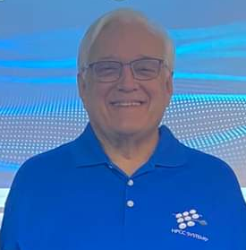
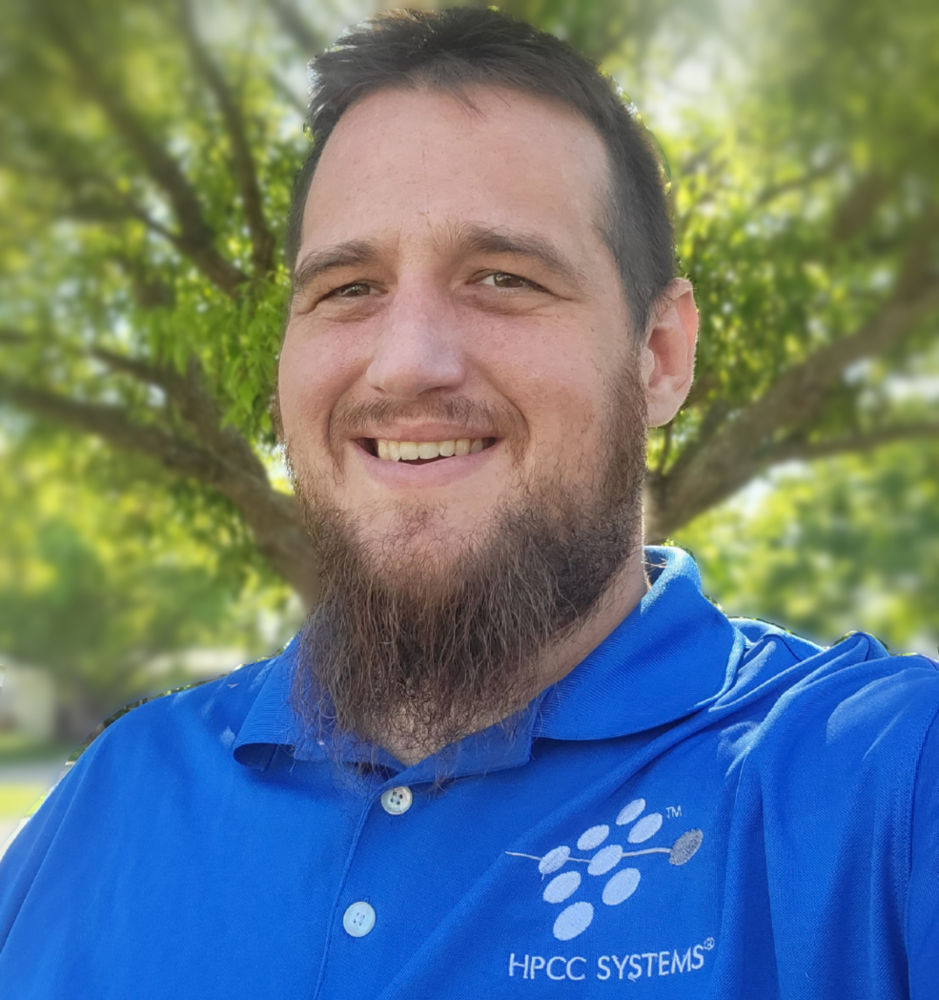
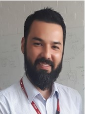

# Help Missing Kids! 
Welcome to the 2025 HPCC Systems and ECL Code Challenge, titled "Help Missing Kids"!

## Introduction
1000 Children go missing every day in the United States. 1 in 6 become victims of human trafficking.

HPCC Systems has partnered with NCMEC (National Center for Missing and Exploited Children) to help notify first responders and law enforcement when a child is reported missing.

What can we do as developers to help understand this problem, and what can we do to help?

## The Challenge
Your challenge is to analyze different social factors such as poverty, unemployment, and other factors and develop insights and additional information for the first reponders.

The goal of the challenge is to answer two questions:

1.	Is there a correlation between the locations that kids are reported missing and other social factors in that area (unemployment, education, poverty, and population).

2.	Can we provide additional information to the NCMEC feed to help find the missing children? (fire and police stations, hospitals, churches, food banks, etc.)

## The Data
**NCMEC Data** has been collected from all 50 states and organized into a simple dataset to use as your central source.

In addition, many public datasets have also been gathered and cleaned to help get you started.

These datasets include:

**Education**

**Unemployment**

**Poverty**

**Population**

**Police**

**Fire Stations**

**Hospitals**

**Places of Worship**

**Food Banks**

Auxiliary Datasets: 

A **Cities** dataset with related FIPS and Zip Codes (used for linking the above datasets to the NCMEC data)

**Unemployment Rates** (Not really used in this challenge but interesting data!)

**You are not limited to using these datasets! Extra credit will be rewarded by linking in other pertinent data!**  

## Tools

Start by installing one or both of the following IDEs: 

Install the flagship ECL IDE if you are a Windows user [ECL IDE Install](https://hpccsystems.com/download/#h-bare-metal-non-containerized-platform).

If you have a Mac or Linux box, install the Visual Studio Code IDE for your appropriate O/S, and then refer to the Installation PDF in the Docs folder of this repository to configure your IDE for ECL usage.  
PDFs in the Docs folder of this repository can be found to guide you through the installation and configuration.

[VS-Code IDE Install Page](https://code.visualstudio.com/download).

Download QuickStart.mod located in in the Docs folder of this repository. This file has the initial code you need for this challenge. 
In both IDEs simply open the MOD file and follow the prompts. CTRL+O in the ECL IDE, and the F1 key in VS-Code will pop up the command dialog, and look for the "ECL: Import 'mod' file" command. 

If you need more information on the ECL jobs you are running please use [ECL Watch Page](http://challenge.us-hpccsystems-dev.azure.lnrsg.io:8010/)

**Note: This cluster will only be active during the event!** After the event, you can create your own localized container cluster, or visit our public "Play" Cluster: (https://play.hpccsystems.com:18010) 

For a quick start on ECL syntax, please visit the [Learn ECL](https://hpccsystems-solutions-lab.github.io/) page. 

## Additional Resources

- ECL training containing six short videos:
https://www.youtube.com/watch?time_continue=192&v=Lk78BCCtM-0

- ECL documentation:
http://cdn.hpccsystems.com/releases/CE-Candidate-9.10.14/docs/EN_US/ECLLanguageReference_EN_US-9.10.14-2.pdf

- Visualization document:
https://cdn.hpccsystems.com/releases/CE-Candidate-9.10.14/docs/EN_US/VisualizingECL_EN_US-9.10.14-2.pdf

- Standard Library:
https://cdn.hpccsystems.com/releases/CE-Candidate-9.10.14/docs/EN_US/ECLStandardLibraryReference_EN_US-9.10.14-2.pdf

- Machine Learning:
https://hpccsystems.com/download/free-modules/machine-learning-library

## Challenge Expectation

Judges will consider the following criteria during final presentation:

- How did you answer the challenge questions?
- How did you approach the solution?
- What datasets did you use? Did you incorporate any new datasets into the challenge?
- How you presented your results (via ROXIE,Visualization or other medium)- please reference pertinent ECL workunits with submission 
- Drawing conclusions (How did we help find missing children?)
- Demo of work via a PowerPoint presentation or live demo by your team

## Submission Instructions

Send an email to us at hackathons@hpccsystems.com
- Include your team name and the ECL Workunit names that contain your ECL work (Example: W20250327-133008)
- No ECL workunits will be accepted after 10 A.M. on Saturday (March 29th)
- Upload any supporting documents describing your work (PDF,PowerPoint, MP4) directly to the Challenge Cluster Landing Zone, and then include the name in your email to us.
- If the document is small (under 1MB) you can also attach it to your email instead of uploading to the Landing Zone.
- We look forward to your submissions! Thank You!

## Tips for a Great Score

- Since your solution is the key part to this challenge you can use "#OPTION('obfuscateOutput', TRUE);" at the start of your code to hide it from being viewed on ECL Watchpage. If you decide to use #OPTION make sure to remove if from the WUID that you shared with the judges. When obfuscateOutput set to true, details are removed from the generated workunit, including ECL code, estimates of record size, and number of records.
- If you want to write the result to a file, make sure the file name starts with your team's name for uniqueness purpose.
- Make sure the query names are unique and easy to identify. Do not use generic names like test, mentors, or roxie. We suggest adding your team's name as well. General names will result in other teams overwriting your files, queries, and results
- We encourage team play so teams that help answer questions in the public forums will be considered favorably in judging.
- Direct emails and direct messages to judges asking for support will be **ignored** and it won't work in team's favor
- We also encourage students to leverage our community forum and/or StackOverflow for ECL coding related questions. Please make sure to tag your questions with **hpcc-ecl**.

## Mentors

<a href = "mailto: robert.foreman@lexisnexisrisk.com">Bob Foreman</a> has been an ECL Trainer for the past 14 years, and has been a Technology Teacher for longer than he wants to admit. He will be your primary onsite contact regarding all ECL related questions during this event.

<a href = "mailto: george.foreman@lexisnexisrisk.com">George Foreman</a> is our HPCC Systems Product Specialist and Business Analyst. He will be available onsite to help you with locating the resources you need during this event.

<a href = "mailto: hugo.watanuki@lexisnexisrisk.com">Hugo Watanuki</a> will be available online in our Teams channel to help you with ECL questions and resources you might need during this event.

<a href = "mailto: mauro.marques@lexisnexisrisk.com">Mauro Marques</a> is a Senior Technical Support Engineer at LexisNexis Risk Solutions, and supports the development and delivery of training programs for the HPCC Systems platform in the Brazil region. He will also be available online in our Teams channel to help you with ECL questions and resources you might need during this event.

<a href = "mailto: alysson.oliveira@lexisnexisrisk.com">Alysson Oliveira</a> is a Software Engineer at LexisNexis Risk Solutions. His main role revolves around support and development of training programs for HPCC Systems in Brazil , covering the academic audience, computing and data professionals and researchers. He also works to establish partnerships with universities to offer undergraduate students the opportunity to work on scientific projects. He will also be available online in our Teams channel to help you with ECL questions and resources you might need during this event.

 
